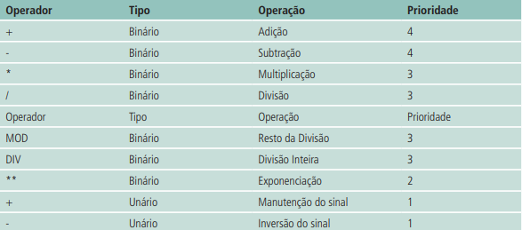
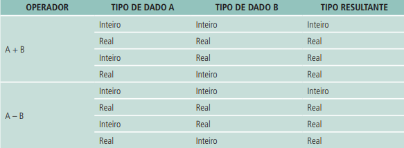
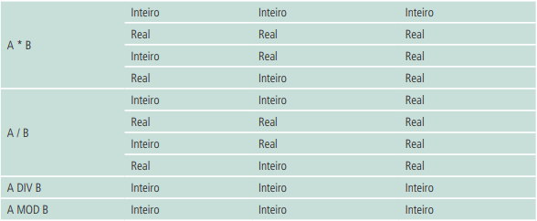
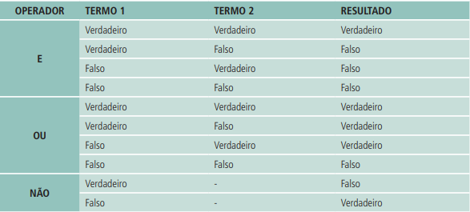

# <h2 style="color: dodgerblue">Operadores </a>

Operadores são elementos funcionais que atuam sobre termos (também chamados de operandos) e produzem um determinado resultado.

Os operadores são, na prática, instruções especiais pelas quais incrementamos, decrementamos, comparamos e avaliamos dados dentro de um programa de computador. Podemos classificar os operadores em três classes:

- <a style="color: dodgerblue"> Operadores Aritméticos;</a> 
- <a style="color: dodgerblue ">Operadores Relacionais;</a> 
- <a style="color: dodgerblue ">Operadores Lógicos.</a> 


Com o uso de operadores é possível construir expressões, assim como na matemática. A complexidade de uma expressão é determinada pela quantidade de operadores e termos (variáveis ou valores constantes). De acordo com o número de termos sobre os quais os operadores atuam, podemos classificá-los em:

## <h2 style="color: dodgerblue"> Operadores Unários  </a>

Unários atuam sobre um único termo. Esta operação é chamada de monódica. Como exemplo, temos os operadores aritméticos básicos: adição, subtração, multiplicação e divisão.

Exemplo:

```Javascript

var a = -10;

```

## <h2 style="color: dodgerblue">Operadores Binários</a>

Binários atuam sobre dois termos. Esta operação é chamada de diadema. Como exemplo, podemos citar os operadores aritméticos (+, -, *, /, %), os operadores relacionais (==, !=, >, <, >=, <=) e os operadores lógicos (&&, ||);

Exemplo:

```Javascript

var a = 10 + 20;

```

## <h2 style="color: dodgerblue">Operadores Ternários</a>

Ternários atuam sobre três termos. Esta operação é chamada de triádica. Como exemplo, podemos citar o operador condicional (condição) ? valor1 : valor2

Este operador pode ser útil em situações em que desejamos atribuir a uma variável, valores diferentes de acordo com determinada condição.

Exemplo:

```javascript

var a = 10 > 20 ? 10 : 20;

// A recebe 20, se 10 for maior que 20, caso contrário, recebe 10.

```

Referências: [O operador condicional ternário](http://www.nce.ufrj.br/ginape/js/conteudo/decisao/ternario.htm)

## <h2 style="color: dodgerblue">Operadores Aritméticos</a>

Os operadores aritméticos são utilizados para obter resultados numéricos. Além da adição, subtração, multiplicação e divisão, grande parte das linguagens de programação também disponibilizam o operador para a operação de exponenciação. Os símbolos para os operadores aritméticos estão listados na tabela a seguir:


A prioridade entre operadores define a ordem em que os mesmos devem ser avaliados dentro de uma mesma expressão, ou seja, operadores de prioridade menor serão avaliados primeiro.

Via de regra, as expressões devem ser calculadas da esquerda para a direita, obedecendo a prioridade descrita na tabela acima. Se existirem expressões dentro de parênteses, estas terão prioridade sobre os demais operadores.

É importante salientar que maioria das linguagens de programação o tipo de dado resultante depende dos tipos de dados dos termos envolvidos na expressão. Por exemplo, se um dos termos for do tipo string, o resultado será uma concatenação de strings. Se um dos termos for do tipo float, o resultado será um float. Se um dos termos for do tipo inteiro, o resultado será um inteiro.




Exemplo:

```Python

a = 10 + 20; # O resultado será do tipo inteiro com valor 30

b = 10 + 20.0; # O resultado será do tipo float com valor 30.0

c = "10" + "20"; # O resultado será do tipo string com valor "1020"

```

## <h2 style="color: dodgerblue">Operadores Relacionais</a>

Os operadores relacionais são utilizados para comparar dois valores. O resultado de uma expressão relacional é sempre um valor lógico (verdadeiro ou falso). Os símbolos para os operadores relacionais estão listados na tabela a seguir:


Estes operadores são somente usados quando se deseja efetuar comparações. Comparações só podem ser feitas entre objetos de mesma natureza, isto é, variáveis do mesmo tipo de dado. O resultado de uma comparação é  sempre um valor lógico. Se a comparação for verdadeira, o resultado será true, caso contrário, false.

Exemplo:

```Python

a = 10 > 20; # O resultado será false

b = 10 < 20; # O resultado será true

c = 10 == 20; # O resultado será false

d = 10 != 20; # O resultado será true

e = "10" == "20"; # O resultado será false

```

Com valores string, os operadores relacionais comparam os valores ASCII dos 
caracteres correspondentes em cada string. Uma string é dita “menor que” 
outra se os caracteres correspondentes tiverem os números de códigos ASCII 
menores. Por exemplo:

```Python

"abc" < "def" # O resultado será true

"abc" < "ab" # O resultado será false

"abc" < "abd" # O resultado será true

"algoritmo" > "ALGORITMO" # O resultado será true

"ABC" < "EFG" # O resultado será true

"Pascal" < "Pascal competir" # O resultado será true

```

`ASCII` (American Standard Code for Information Interchange) é um código de caracteres de 7 bits, que permite a representação de 128 caracteres. O código ASCII é utilizado para representar letras, números, sinais de pontuação e outros caracteres especiais. O código ASCII é um padrão internacional, utilizado por todos os computadores para a representação de caracteres.
[Tabela ASCII](https://www.ime.usp.br/~pf/algoritmos/apend/ascii.html)

Dica: Utilizando o atalho `Alt + 65` no teclado numérico, você pode digitar o caractere `A` maiúsculo. Para digitar o caractere `a` minúsculo, utilize o atalho `Alt + 97`.

Vale ressaltar que não é eficaz comparar valores do tipo real com os operadores de igualdade em virtude de a representação em ponto flutuante ser inexata em alguns casos.

Apesar de algebricamente correta, a expressão (1.0/3.0) + (1.0/3.0) + (1 .0/3.0) = 1 é avaliada como falsa devido ao fato de 1.0/3.0 ter como resultado um valor que contém número infinito de casas decimais (3.3333333 ...). O computador é apenas capaz de utilizar um número finito de casas decimais e, portanto, é feito um arredondamento do valor de 1/3 em cada ocorrência. Para evitar os erros causados pela representação inexata de valores reais, deve-se evitar utilizar as comparações de igualdade com números reais.

Exemplo:

```Python

a = 1.0/3.0 + 1.0/3.0 + 1.0/3.0;

b = 1;

c = a == b; # O resultado será false

```

## <h2 style="color: dodgerblue">Operadores Lógicos</a>

Os operadores lógicos, também conhecidos como operadores booleanos são utilizados para combinar valores lógicos. O resultado de uma expressão lógica é sempre um valor lógico (verdadeiro ou falso).

Esse tipo de operador é amplamente usado na composição de expressões lógicas que são muito utilizadas nas estruturas de decisão e repetição em um programa. Os operadores lógicos são:

- `E` (do inglês `AND`) - uma expressão desse tipo é verdadeira se todas as condições forem verdadeiras;

- `OU` (do inglês `OR`) - uma expressão desse tipo é verdadeira se pelo menos 
uma das condições forem verdadeiras;

- `NÃO` (do inglês `NOT`) - uma expressão desse tipo inverte o valor da expressão 
ou condição, se verdadeira inverte para falsa e vice-versa.

O resultado de uma operação lógica vai depender dos valores dos termos 
submetidos. A seguir é apresentada uma tabela com os tipos de dados resultantes de cada operador.



O quadro a seguir mostra a prioridade do uso dos operadores lógicos:


Por exemplo, na expressão:
(A=B) .OU. .NÃO. (A<9)
Devemos avaliar primeiro: .NÃO. (A<9).
Depois, avaliamos: (A=B) .OU. (resultado da expressão anterior).

Exemplo:

```Python

a = 10 > 20 and 20 > 10; # O resultado será false

b = 10 > 20 or 20 > 10; # O resultado será true

c = not 10 > 20; # O resultado será true

```

## <h2 style="color: dodgerblue">Operador de concatenação</a>

O operador de concatenação é utilizado para juntar dois valores ou variáveis do tipo texto (String) em uma única string. O resultado da concatenação é uma string que contém os caracteres das duas strings concatenadas. O operador de concatenação é binário, ou seja, atua sobre dois termos. O operador de concatenação é utilizado em linguagens de programação para a concatenação de strings. O símbolo para o operador de concatenação é o sinal de adição (+).

Exemplo:

```Python

a = "Hello" + "World"; # O resultado será "HelloWorld"

b = "Hello" + " " + "World"; # O resultado será "Hello World"

c = "Hello" + "10"; # O resultado será "Hello10"

d = "10" + "Hello"; # O resultado será "10Hello"

```

## <h2 style="color: dodgerblue">Operador de atribuição</a>

O operador de atribuição é utilizado para atribuir um valor a uma variável. O operador de atribuição é binário, ou seja, atua sobre dois termos. O símbolo para o operador de atribuição é o sinal de igual (=).

Exemplo:

```Python

a = 10; # A variável a recebe o valor 10

b = 20; # A variável b recebe o valor 20

c = a + b; # A variável c recebe o valor 30

```


## <h2 style="color: dodgerblue">Operadores de incremento e decremento</a>

Os operadores de incremento e decremento são utilizados para incrementar ou decrementar o valor de uma variável. O operador de incremento é unário, ou seja, atua sobre um único termo. O operador de incremento é utilizado para incrementar o valor de uma variável em uma unidade. O operador de decremento é utilizado para decrementar o valor de uma variável em uma unidade. O símbolo para o operador de incremento é o sinal de mais (+). O símbolo para o operador de decremento é o sinal de menos (-).

Exemplo:

```Python

a = 10; # A variável a recebe o valor 10

a++; # A variável a recebe o valor 11

a--; # A variável a recebe o valor 10

```

## <h2 style="color: dodgerblue">Operadores de atribuição combinados</a>

Os operadores de atribuição combinados são utilizados para atribuir um valor a uma variável e realizar uma operação aritmética ao mesmo tempo. O operador de atribuição combinado é binário, ou seja, atua sobre dois termos. O símbolo para o operador de atribuição combinado é o sinal de igual seguido do operador aritmético desejado.

Exemplo:

```Python

a = 10; # A variável a recebe o valor 10

a += 20; # A variável a recebe o valor 30

a -= 10; # A variável a recebe o valor 20

a *= 2; # A variável a recebe o valor 40

a /= 2; # A variável a recebe o valor 20

```

## <h2 style="color: dodgerblue">Operadores de igualdade e diferença</a>

Os operadores de igualdade e diferença são utilizados para comparar dois valores. O resultado de uma expressão de igualdade ou diferença é sempre um valor lógico (verdadeiro ou falso). O operador de igualdade é binário, ou seja, atua sobre dois termos. O operador de diferença é binário, ou seja, atua sobre dois termos. O símbolo para o operador de igualdade é o sinal de igual seguido do sinal de igual. O símbolo para o operador de diferença é o sinal de exclamação seguido do sinal de igual.

Exemplo:

```Python

a = 10; # A variável a recebe o valor 10

b = 20; # A variável b recebe o valor 20

c = a == b; # O resultado será false

d = a != b; # O resultado será true

```

## Recomendação de leitura

- [Operadores Aritméticos e Lógicos em Python](https://pythonacademy.com.br/blog/operadores-aritmeticos-e-logicos-em-python)

- [Expressões e operadores em JavaScript](https://developer.mozilla.org/pt-BR/docs/Web/JavaScript/Guide/Expressions_and_Operators)

- [Operadores da linguagem ADVPL/TLPP](https://tdn.totvs.com/display/tec/Operadores+da+linguagem)

- [Operadores lógicos e matemáticos da linguagem Java](https://www.devmedia.com.br/operadores-logicos-e-matematicos-da-linguagem-java/25248)

## Referências

- [Operadores e Expressões](https://www.ibm.com/docs/pt-br/tcamfma/6.3.0?topic=tesl-operators-expressions)
- [Operadores Aritméticos e Lógicos em Python](https://pythonacademy.com.br/blog/operadores-aritmeticos-e-logicos-em-python)
- [Operadores Lógicos - AND, OR e NOT](https://www.pythonprogressivo.net/2018/02/Operadores-logicos-AND-OR-NOT.html)