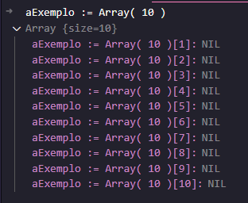
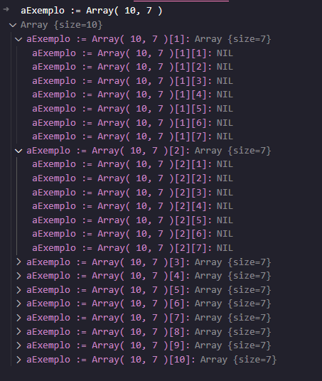
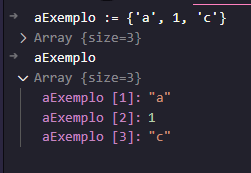

# 8 - Estruturas homogêneas: vetores e matrizes

## Vetores

### Introdução

Vetores são conhecidos como variáveis compostas homogêneas unidimensionais. Isto quer dizer que se trata de um conjunto de variáveis de mesmo tipo, que possuem o mesmo identificador (nome) e são armazenadas sequencialmente na memória. Como as variáveis tem o mesmo nome, o que as distingue é um índice que referencia sua localização dentro da estrutura, ou seja, podemos identificar o primeiro, o segundo, até o último elemento do conjunto que pode ser identificado por sua posição.

- Vetores são estruturas de dados homogêneas, ou seja, que armazenam dados do mesmo tipo;
- São estruturas de dados sequenciais, ou seja, que armazenam dados de forma sequencial, um após o outro;
- São estruturas de dados indexadas, ou seja, que armazenam dados de forma indexada, cada elemento do vetor possui um índice que o identifica.

Fazendo uma analogia, podemos identificar a presença de um vetor à lista de alunos de uma turma em uma escola. Nessas escolas, os alunos recebem números conforme a ordem alfabética de seus nomes na turma. Cada aluno sabe seu número e, em certas oportunidades, o uso deste número é útil para cada um deles.

### Declaração de vetores

O Array (ou Matriz) no AdvPL é um tipo básico de dado que permite criar listas de tamanho e conteúdo dinâmico.

Cada elemento de um array pode conter elementos de qualquer tipo do AdvPL, inclusive os tipos “B” (CodeBlock), “O” (Objeto), “U” (NIL — ou Nulo), inclusive o tipo “A” (Array).

O conteúdo de cada elemento do array pode ser endereçado diretamente pela sua posição ordinal no Array, bastando para isso colocar em frente ao array a posição desejada entre [ ] (colchetes). Os Arrays em AdvPL começam na posição 1.

O Tipo de dado “A” Array no AdvPL é tratado como uma variável de referência implícita. Desse modo, quando fazemos uma atribuição de uma variável que contém um array para outra variável, é criada uma referência ao array armazenado na primeira variável. Isto significa que, na memória o array é único, e agora eu tenho duas variáveis que apontam para o mesmo conteúdo. Se eu alterar o conteúdo de um elemento dentro desse array, as duas variáveis vão apontar para o mesmo conteúdo alterado.

#### Declaração de vetores com a função Array()

Para declarar um vetor podemos utilizar a função **Array()**, que recebe como parâmetro o tamanho do vetor. O tamanho do vetor é a quantidade de elementos que ele pode armazenar. O tamanho do vetor é um número inteiro positivo.

Sintaxe:

```advpl

Array( < nElementos1 >, [ xElemento2,xElemento3...xElemento16 ] )

```

Parâmetros:

- nElementos1: número inteiro que indica a quantidade de elementos que o vetor pode armazenar;
- xElemento2,xElemento3...xElemento16: são os elementos que serão armazenados no vetor. Se for numérico, cria um array multidimensional, se for diferente de número inicializa o array com o valor informado.

Retorno:

- Retorna um array com a dimensão especificada.

Observações:

- Até 16 parâmetros podem ser informados, para criar arrays multidimensionais. Somente o último parâmetro pode ser diferente de número para inicializar o array o valor informado.

Exemplos:

```advpl

aExemplo := Array( 10 ) // declara um vetor de 10 elementos

```



aExemplo := Array( 10, 7 ) // declara um vetor de 10 elementos multidimensional, com todos 7 elementos

```advpl

aExemplo := Array( 10, 7 )

```



#### Declaração de vetores com ou sem elementos definidos

Para declarar um vetor sem elementos, usando abertura e fechamento de chaves  { }.

Para declarar um array com conteúdo, basta informar o conteúdo de cada elemento dentro das chaves, e separar os elementos por vírgula.

Exemplo:

```advpl

aExemplo := {} // declara um vetor sem elementos ou vazio

```


### Declaração e atribuição de valores a vetores

Para atribuir valores a um vetor, basta informar o conteúdo de cada elemento dentro das chaves, e separar os elementos por vírgula.

Exemplo:

```advpl
aExemplo := {'a', 'b', 'c'} // declara um vetor com 3 elementos

```


```advpl
aExemplo := {'a', 1, 'c'} // declara um vetor com 3 elementos

```



### Inclusão de elementos em vetores

Para incluir elementos em um vetor utilizamos a função **aAdd()**. Esta função recebe como parâmetro o vetor e o elemento que será incluído no vetor.

Sintaxe:

```advpl

aAdd( < aArray >, < xElemento > )

```

Parâmetros:

- aArray: array que receberá o elemento;
- xElemento: Indica uma expressão válida que será o valor do novo elemento.

Retorno:

- Retorna o valor especificado em xElemento.

Observações:

- Caso seja especificado em `xElemento` um outro array, o novo elemento no array destino terá uma referência ao array especificado.
- Essa função é útil na construção de filas ou listas dinâmicas. Utilize para aumentar o tamanho de um array dinamicamente.
- Essa função é semelhante a função ASize, mas adiciona apenas um elemento por vez. Já `ASize` permite aumentar ou diminuir um array a um tamanho especificado. AAdd também possui a vantagem de poder atribuir um valor ao novo elemento, enquanto que ASize não pode. Além disso, AAdd pode parecer igual a função `AIns`, mas não é, pois AIns move os elementos dentro de um array, mas não modifica seu tamanho.

Exemplos:

```advpl

aExemplo := {} // declara um vetor sem elementos ou vazio

aAdd( aExemplo, 'a' ) // inclui o elemento 'a' no vetor
aAdd(aExemplo, {}) // inclui um array vazio no vetor

```
